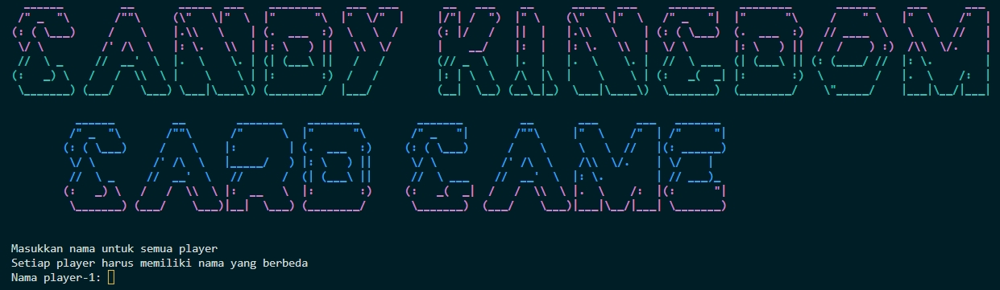
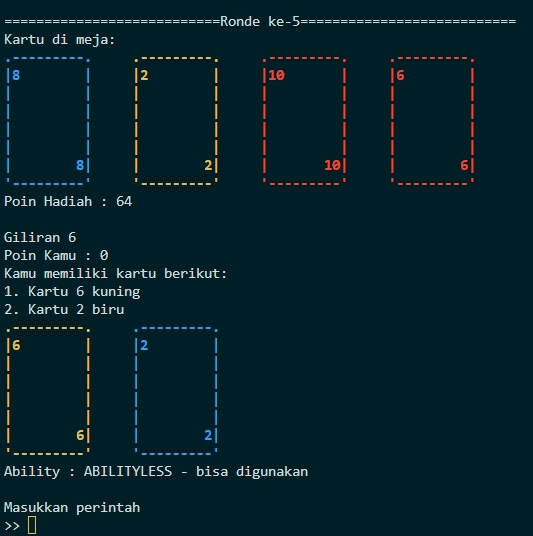

# Tugas Besar 1 IF - 2022/2023
Kompetisi Kartu ala Kerajaan Permen

## Table of Contents
* [General Info](#general-information)
* [Technologies Used](#technologies-used)
* [Features](#features)
* [Screenshots](#screenshots)
* [Setup](#cara-menjalankan-program)
* [Project Status](#project-status)
* [Room for Improvement](#room-for-improvement)
* [Pembagian](#pembagian-tugas)

## General Information
### Pesta kerajaan permen

Dalam rangka merayakan pesta panen gula di kerajaan permen, akan diadakan kompetisi massal permainan kartu ala Kerajaan Permen. Ratu kerajaan permen ingin mencari pemain kartu terhebat di kerajaannya. Namun karena Ratu tidak bisa memantau permainan satu-persatu, kalian diminta untuk membuatkan sistem agar permainan dapat berjalan dengan adil. Bantulah ratu kerajaan permen untuk membuatkan permainan ala kerajaan permen.

1. Program menginisiasi 7 pemain. Dan secara bergiliran, player melakukan input  nama/nickname. Setiap player akan memiliki poin 0 pada mula-mula.

2. Poin hadiah awalnya akan dibuat sejumlah 64. Poin ini akan dinamis bertambah/berkurang tergantung perintah dari setiap pemain. Poin akan diberikan diujung ronde (ronde 6).

3. Program akan mengeluarkan sebuah menu dan memberikan 2 opsi untuk melakukan generasi urutan kartu pada deck untuk permainan ini. Pertama yaitu dengan opsi random. Kedua, opsi baca dari file
Untuk keperluan demo, sediakan opsi untuk memanipulasi urutan kartu pada deck dengan cara membaca teks dari sebuah file.

4. Program akan memulai permainan ini dengan putaran permainan yang dijelaskan pada bagian Mekanisme di poin Putaran Permainan.
5. Dalam permainan, pemain dapat memilih sebuah perintah, daftar perintah sebagai berikut:

       "DOUBLE"
       "NEXT"
       "HALF"
       Ability : 
         "ABILITYLESS"
         "SWAP"
         "RE-ROLL"
         "QUADRUPLE"
         "REVERSE"
         "SWITCH"
         "QUARTER" 

6. Pada akhir permainan, poin hadiah akan diberikan ke pemenang. Dan pemain lain tidak mendapatkan poin. Permainan berakhir jika seorang pemain memiliki poin lebih dari sama dengan 2^32 poin.

7. Jika belum ada yang menyentuh 2^32 poin, maka permainan akan dilanjutkan dengan memulai dari ronde awal lagi. Kartu dikembalikan, pemain akan mendapat kartu kemampuan acak di ronde kedua dan seterusnya. Program juga akan mengeluarkan menu untuk memberikan opsi random/baca dari file untuk permainan selanjutnya.

## Technologies Used
- C++
- Standard Template Library (STL)

## Features
List the ready features here:
- Interactive Command line interface 

## Screenshots

## Cara menjalankan program 
1. Buka terminal pada direktori folder src yang berisi main.cpp 
2. Ketik "./run.sh" pada terminal ubuntu

## Project Status
Project is: _complete_ 

## Room for Improvement

Room for improvement:
- speed up algorithm

## Pembagian Tugas
1. 13521041 / Muhammad Hanan
2. 13521043 / Nigel Sahl
3. 13521109 / Rizky Abdillah Rasyid
4. 13521121 / Saddam Annais Shaquille
5. 13521157 / Hanif Muhammad Zhafran
